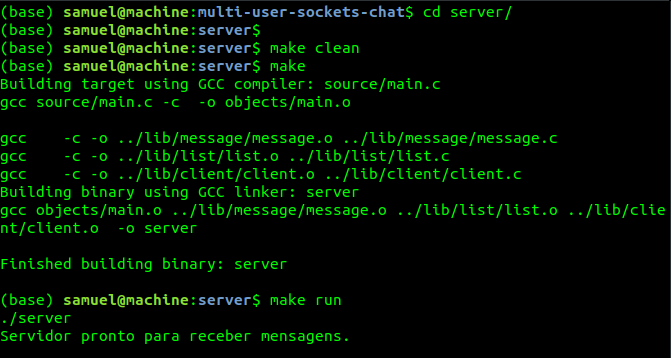
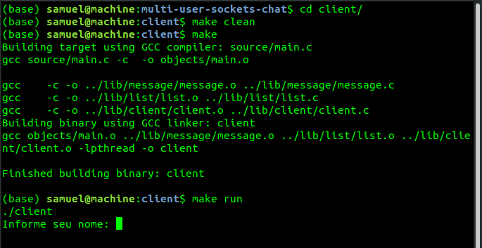

# Multi user sockets chat

### How to run:

Follow this steps:

#### Server:
```shell script
cd server/
make clean
make
make run
```

#### Client:
```shell script
cd client/
make clean
make
make run
```

### Preview:

Server:




Client:
